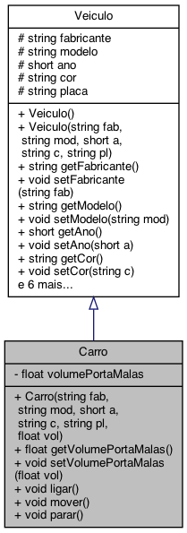
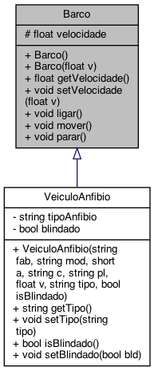
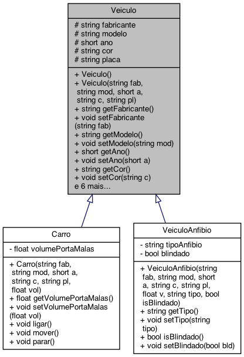

# Veiculos

## Sobre

Este programa serve à demonstração do mecanismo de herança oferecido pela linguagem de programação C++ utilizando classes que representam diferentes tipos de veículo.

## Modelagem

Este programa agrega quatro classes. A classe [`Veiculo`](include/veiculo.h) define um veículo contendo informações básicas acerca de um veículo qualquer, a saber, fabricante, modelo, ano de fabricação, cor e placa. Essa classe serve de base para a classe [`Carro`](include/carro.h), a qual define um carro herdando todos os atributos definidos na classe `Veiculo` e adiciona uma nova informação, o volume do porta malas do carro, além de sobrescrever os métodos originalmente definidos. A classe [`Barco`](include/barco.h) define um barco com uma única informação, a sua velocidade média. As classes `Veiculo` e `Barco` servem juntamente como base para a definição, via herança múltipla, da classe [`VeiculoAnfibio`](include/anfibio.h), a qual representa um veículo anfíbio que reúne todos os atributos definidos nas classes que lhe serviram de base e adiciona duas novas informações, o tipo do veículo anfíbio e se ele é blindado ou não.

Os diagramas a seguir representam os relacionamentos entre as classes que compõem o programa:





## Estrutura do projeto

Primando pela modularização, a definição e a implementação da classe `Tempo` está separada em um arquivo cabeçalho [`tempo.h`](include/tempo.h) e de corpo [`tempo.cpp`](src/tempo.cpp). O arquivo [`main.cpp`](src/main.cpp) correspondente à implementação da função principal do programa. Os arquivos deste projeto estão assim organizados de acordo com a seguinte estrutura:

```text
+─veiculos              ---> Nome do diretório do projeto
  ├─── CMakeLists.txt   ---> Script de configuração do cmake
  ├─── Doxyfile         ---> Arquivo de configuração para geração de documentação com Doxygen
  ├─── build            ---> Diretório onde os arquivos executáveis serão gerados
  ├─── doc              ---> Diretório onde a documentação em HTML será gerada
  ├─── include          ---> Diretório que contém os arquivos cabeçalho (.h)
       └─── anfibio.h   ---> Arquivo cabeçalho referente à definição da classe VeiculoAnfibio
       └─── barco.h     ---> Arquivo cabeçalho referente à definição da classe Barco
       └─── carro.h     ---> Arquivo cabeçalho referente à definição da classe Carro
       └─── veiculo.h   ---> Arquivo cabeçalho referente à definição da classe Veiculo
  └─── src              ---> Diretório que contém os arquivos corpo (.cpp)
       └─── anfibio.cpp ---> Arquivo fonte referente à implementação da classe VeiculoAnfibio
       └─── barco.cpp   ---> Arquivo fonte referente à implementação da classe Barco
       └─── carro.cpp   ---> Arquivo fonte referente à implementação da classe Carro
       └─── main.cpp    ---> Arquivo fonte contendo a implementação da função principal do programa
       └─── veiculo.cpp ---> Arquivo fonte referente à implementação da classe Veiculo
```

## Requisitos

Para a compilação e execução deste programa, os seguintes elementos devem estar devidamente instalados no ambiente de desenvolvimento:

- [Git](https://git-scm.com), como sistema de controle de versões
- [*GNU Compiler Collection*](https://gcc.gnu.org) (a qual inclui o compilador `g++`), [`clang`](https://clang.llvm.org/) ou qualquer outro compilador para a linguagem C++
- [`cmake`](https://cmake.org/), para gerar *makefiles* automaticamente e de forma otimizada para o projeto
- [Doxygen](https://www.doxygen.nl), para geração automática de documentação

## Download, compilação e execução do programa

No terminal do sistema operacional, insira os seguintes comandos para realizar o *download* da implementação a partir deste repositório Git e navegar para o diretório resultante:

```bash
 # Download da implementação a partir do repositório Git
 git clone https://github.com/bti-ufrn-lp1/veiculos.git
 
 # Navegação para o diretório
 cd veiculos
```

Em seguida, insira os seguintes comandos no terminal do sistema operacional para gerar automaticamente o *makefile* e, em seguida, compilar o programa:

```bash
 # Criação do diretório build
 mkdir build
 cd build

 # Utilização do CMake para geração do Makefile
 cmake ..
 
 # Compilação e geração do executável do programa
 cmake --build .
```

Esses comandos irão gerar, além de um conjunto de arquivos e diretórios resultantes dos processos de compilação e ligação do programa, o arquivo executável do programa, ``veiculos``, no diretório ``build``.

Finalmente, para executar o programa gerado, basta inserir o seguinte comando no terminal do sistema operacional (a partir do diretório `build`):

```bash
 ./veiculos
```

Nesse caso, o programa irá exibir na saída padrão informações de diferentes de veículo, mais precisamente dois carros, um barco e um veículo anfíbio.
